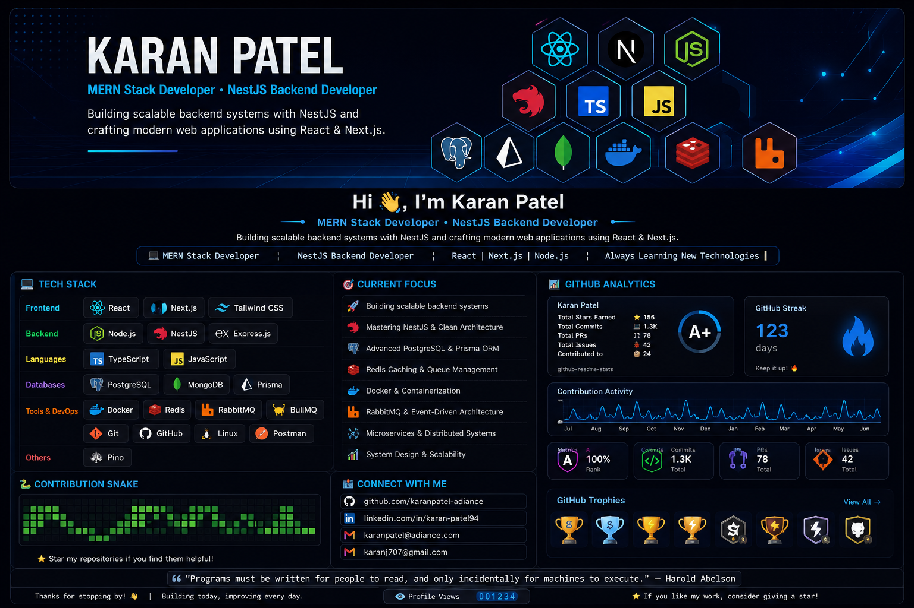

  

-----------------------------------------------------------------------

## 🚀 About Me

-   💻 Full Stack JavaScript Developer with a strong focus on backend
    development
-   ⚙️ Building scalable backend services with Node.js, NestJS &
    Express.js
-   🌐 Developing modern web applications using React.js & Next.js
-   🛢️ Working with MongoDB, Mongoose, PostgreSQL & Prisma ORM
-   🔐 Passionate about Authentication, Authorization, Security & Clean
    Architecture
-   🐳 Currently learning Docker, Redis, RabbitMQ, BullMQ & Pino
-   📚 Exploring System Design, Microservices & Cloud Technologies

------------------------------------------------------------------------

# 💻 Tech Stack

 

 

 

------------------------------------------------------------------------

  
## 🎯 Current Focus

-   🚀 Building scalable backend systems
-   ⚙️ Mastering NestJS & Clean Architecture
-   🗄️ Advanced PostgreSQL & Prisma ORM
-   ⚡ Redis Caching & Queue Management
-   🐳 Docker & Containerization
-   📨 RabbitMQ & Event-Driven Architecture
-   🧩 Microservices & Distributed Systems
-   📈 System Design & Scalability
  

------------------------------------------------------------------------

##Github Analytics

  
  

  

  

  

------------------------------------------------------------------------

## 🐍 Contribution Snake

<picture>
  <source
    media="(prefers-color-scheme: dark)"
    srcset="https://raw.githubusercontent.com/karanpatel-adiance/karanpatel-adiance/output/github-contribution-grid-snake-dark.svg"
  />
  <source
    media="(prefers-color-scheme: light)"
    srcset="https://raw.githubusercontent.com/karanpatel-adiance/karanpatel-adiance/output/github-contribution-grid-snake.svg"
  />
  
</picture>

------------------------------------------------------------------------

## 📫 Connect With Me

  

  

  

------------------------------------------------------------------------

## 💭 Engineering Philosophy

> **"Programs must be written for people to read, and only incidentally for machines to execute."**

**— Harold Abelson**

------------------------------------------------------------------------

## 👋 Thanks for Stopping By!

*"Great software isn't just about writing code—it's about solving real problems with clean, scalable solutions."*

 

⭐ **If you find my work interesting, feel free to connect, collaborate, or explore my repositories.**

 

### 🚀 Always Learning • Always Building • Always Improving

