<div align="center">

# Hi 👋, I'm Karan Patel

### MERN Stack Developer • NestJS Backend Engineer

<p>
Building Scalable APIs • PostgreSQL • Prisma • Docker • Redis • RabbitMQ
</p>

</div>

<p align="center">

[](https://git.io/typing-svg)

</p>

---

## 🚀 About Me

- 💻 MERN Stack & Backend Developer
- ⚙️ Building scalable backend services with Node.js, NestJS & Express.js
- 🌐 Developing modern web applications with React.js & Next.js
- 🛢️ Working with MongoDB, Mongoose, PostgreSQL & Prisma ORM
- 🔐 Passionate about Authentication, Authorization & Security
- 🐳 Currently learning Docker, Redis, RabbitMQ, BullMQ & Pino
- 📚 Exploring System Design, Microservices & Cloud Technologies
---

## 💻 Tech Stack

<p align="center">


</p>

---

## 🎯 Current Focus

```text
✓ Building scalable backend systems
✓ NestJS & Clean Architecture
✓ PostgreSQL + Prisma ORM
✓ Redis Caching
✓ Docker & Containerization
✓ System Design
✓ Microservices
```
---

## 📊 GitHub Statistics

<p align="center">
  
  
</p>

---

## 📊 GitHub Metrics

<p align="center">
  
</p>

---

## 🚀 Featured Projects

<table>
<tr>

<td width="50%">
<h3 align="center">Task Management System</h3>

<p align="center">

Backend-first task management application built with NestJS, PostgreSQL, Prisma and JWT Authentication.

<br><br>


<br><br>

<a href="YOUR_GITHUB_REPO_LINK">

</a>

</p>

</td>

<td width="50%">
<h3 align="center">MERN E-Commerce</h3>

<p align="center">

Full-stack e-commerce platform featuring authentication, payments, admin dashboard and order management.

<br><br>


<br><br>

<a href="YOUR_GITHUB_REPO_LINK">

</a>

</p>

</td>

</tr>
</table>

---

## 🔥 GitHub Streak

<p align="center">
  
</p>

---

## 📈 Contribution Graph

[](https://github.com/karanpatel-adiance)

---

## 🐍 Contribution Snake

<p align="center">

<picture>
  <source media="(prefers-color-scheme: dark)" srcset="https://raw.githubusercontent.com/karanpatel-adiance/karanpatel-adiance/output/github-contribution-grid-snake-dark.svg">
  <source media="(prefers-color-scheme: light)" srcset="https://raw.githubusercontent.com/karanpatel-adiance/karanpatel-adiance/output/github-contribution-grid-snake.svg">
  
</picture>

</p>

---

## 🏆 GitHub Trophies

<p align="center">

</p>

---

<p align="center">

<a href="https://github.com/karanpatel-adiance">

</a>

<a href="https://linkedin.com/in/karan-patel94">

</a>


<a href="mailto:karanpatel@adiance.com">

</a>


<a href="mailto:karanj707@gmail.com">

</a>

</p>
---

## 💭 Engineering Mindset

> **"Programs must be written for people to read, and only incidentally for machines to execute."**
>
> — Harold Abelson
>
> ---
>
> <p align="center">

Thanks for visiting my profile! ⭐

If you like my work, consider following me and exploring my repositories.

</p>

---
